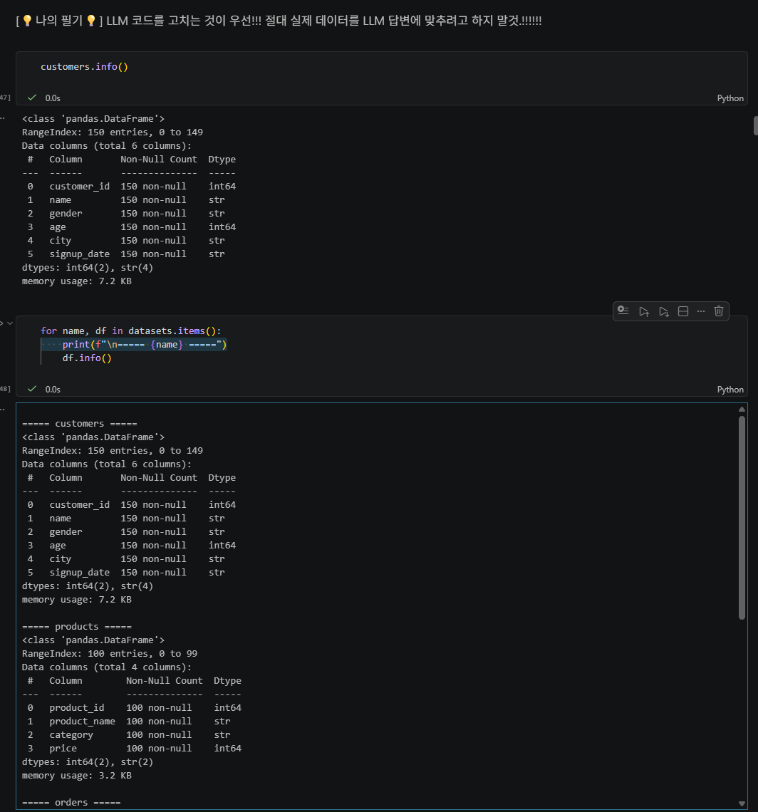
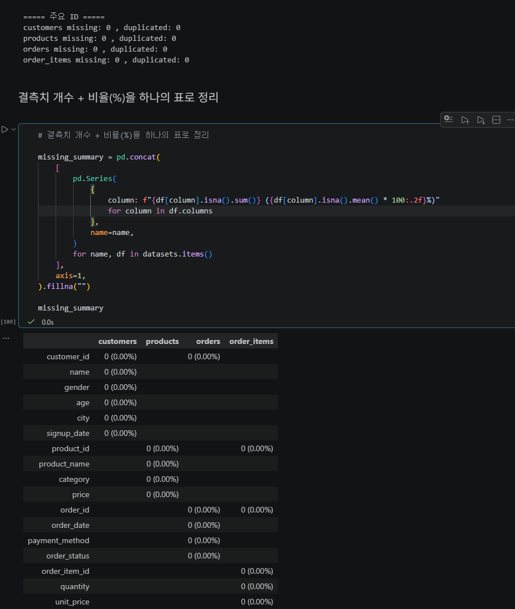
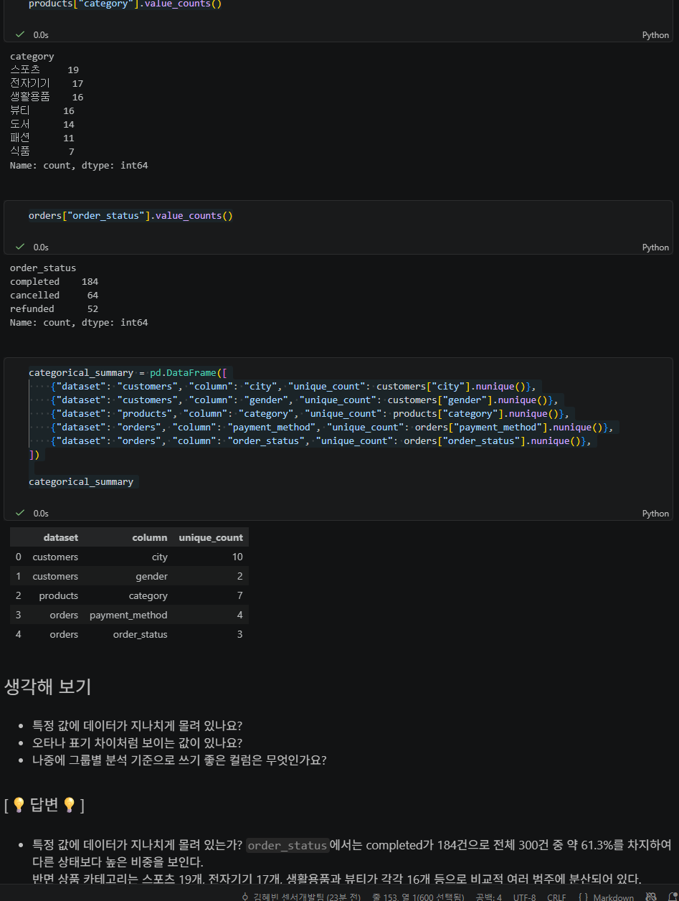
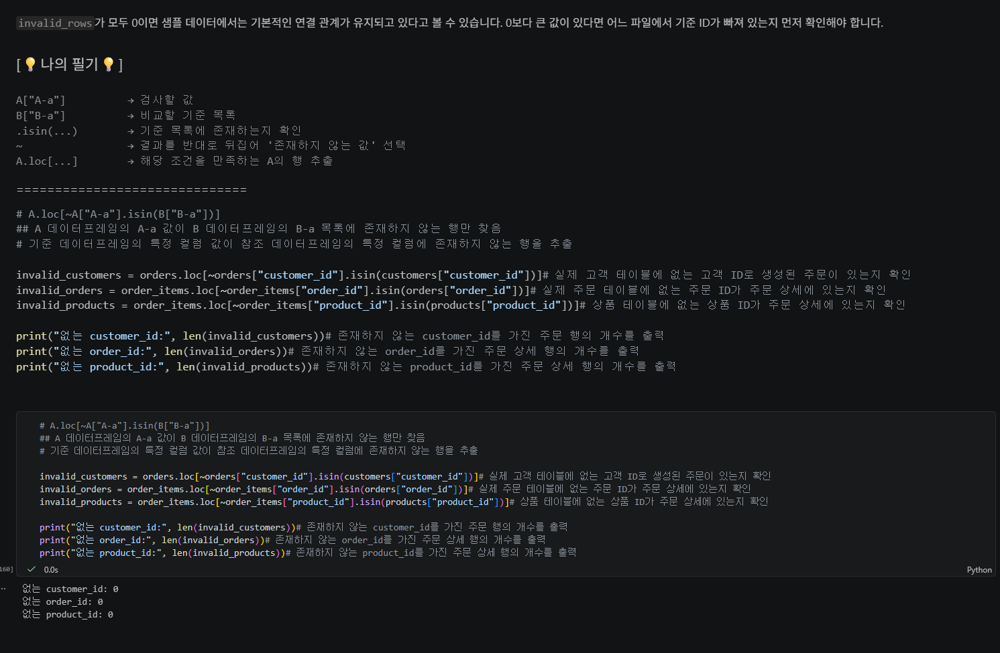
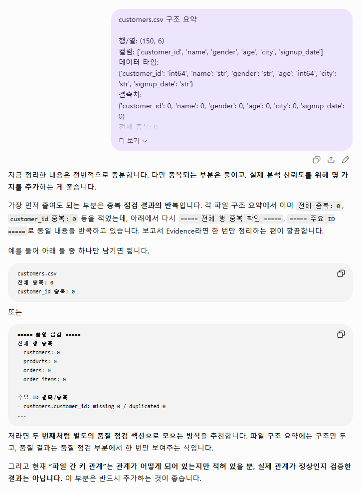
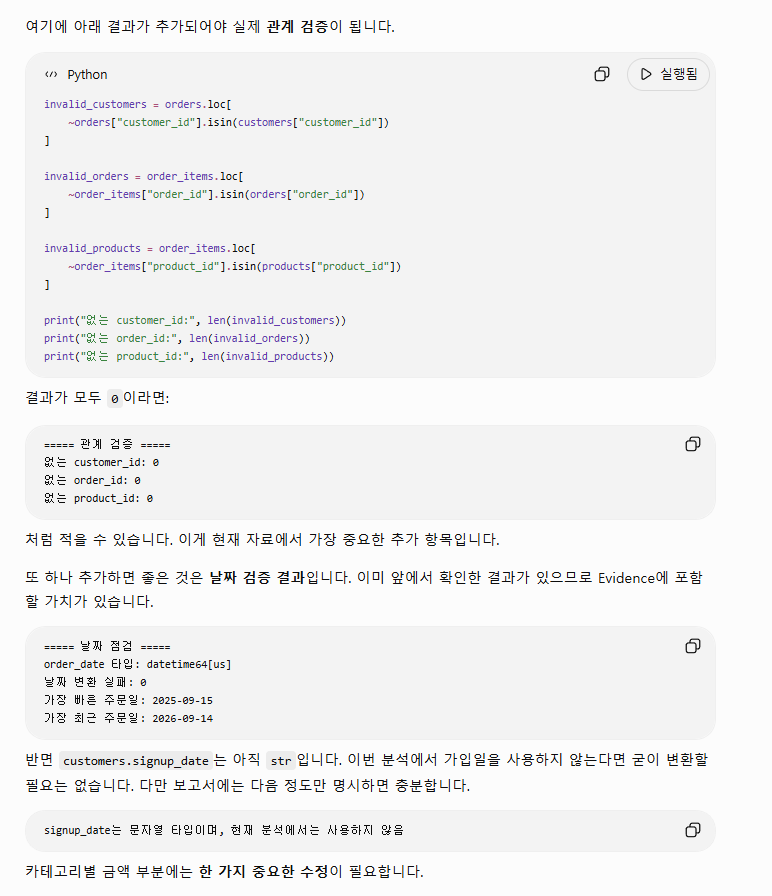

# Chapter 03 제출 답안 양식. 데이터의 첫인상 읽기

> 주 제출물은 실행 완료 Notebook `chapter03/chapter03.ipynb`입니다. 이 양식의 항목을 Notebook의 Markdown 셀로 추가해 작성합니다.

## 0. 제출 정보
- 이름: 김혜빈
- GitHub ID: Chloe-Hyebin-Kim
- 작성일: 2026-09-15
- 최종 제출 URL:

## 1. 데이터 로딩과 구조 확인
### 실행/결과

* 4개 CSV 로딩 여부: customers.csv, products.csv, orders.csv, order_items.csv 모두 정상적으로 로딩됨

* 각 데이터 shape:
  - customers: `(150, 6)`
  - products: `(100, 4)`
  - orders: `(300, 5)`
  - order_items: `(764, 5)`

* 주요 컬럼:
  - customers: `customer_id`, `name`, `gender`, `age`, `city`, `signup_date`
  - products: `product_id`, `product_name`, `category`, `price`
  - orders: `order_id`, `customer_id`, `order_date`, `payment_method`, `order_status`
  - order_items: `order_item_id`, `order_id`, `product_id`, `quantity`, `unit_price`

* dtypes에서 주목한 컬럼:
  - `customer_id`, `product_id`, `order_id`, `order_item_id` 등 ID 컬럼은 정수형으로 저장되어 있다.
  - `age`, `price`, `quantity`, `unit_price`도 정수형으로 저장되어 있어 기본적인 수치 계산이 가능하다.
  - 최초 CSV 로딩 시 `orders.order_date`와 `customers.signup_date`는 문자열형으로 확인되었다.
  - `orders.order_date`는 이후 `datetime64[us]` 타입으로 정상 변환되었다.
  - `customers.signup_date`도 별도 변환 검사에서 실패가 0건이었지만, 분석에 사용할 경우 날짜형으로 명시적으로 변환할 필요가 있다.

### Evidence

### 결과 관찰

4개의 CSV 파일이 모두 정상적으로 로딩되었으며,  
데이터 규모는 customers 150행, products 100행, orders 300행, order_items 764행이다.  
각 데이터셋에는 고객, 상품, 주문, 주문 상세를 구분할 수 있는 ID 컬럼이 존재한다.   
주문 상세인 `order_items`가 764행으로 주문 데이터 300행보다 많은데,  
하나의 주문에 여러 상품이 포함될 수 있는 구조이므로 행 수 차이 자체를 오류라고 볼 수는 없다.  
숫자 계산에 사용되는 `age`, `price`, `quantity`, `unit_price`는 정수형으로 확인되었다.  
반면 날짜 정보는 최초 로딩 시 문자열로 읽힐 수 있으므로 날짜 분석 전에 타입 변환 여부를 확인해야 한다.

### 나의 해석과 판단

분석 전에 특히 주의해야 할 데이터는 `orders`와 `order_items`이다.  
`orders`에는 `order_status`가 있기 때문에 매출을 계산할 때 완료, 취소, 환불 주문 가운데 어떤 상태를 포함할지 먼저 의해야 한다.   
이를 결정하지 않고 모든 주문을 매출로 계산하면 실제 확정 매출과 다른 결과가 나올 수 있다.  
또한 `products.price`와 `order_items.unit_price`가 모두 가격처럼 보이지만,   
두 컬럼의 업무적 의미가 동일하다고 현재 구조만으로 단정할 수 없다.   
실제 판매금액을 계산할 때 어떤 가격을 사용해야 하는지 확인해야 한다.

### 업무·분석적 의미

데이터 구조를 먼저 확인하지 않고 분석을 시작하면 잘못된 컬럼을 사용하거나 테이블 관계를 잘못 이해할 수 있다.   
예를 들어 주문 건수와 주문 상세 행 수를 같은 개념으로 해석하거나, `products.price`를 실제 판매 단가라고 가정하면   
잘못된 매출 계산으로 이어질 수 있다. 또한 날짜가 문자열 상태라면 기간 필터링이나 월별 집계 과정에서 예상하지 못한 문제가 발생할 수 있다.   
따라서 본격적인 분석 전에 각 데이터셋의 역할, 컬럼 타입, 키 관계를 확인하는 과정이 필요하다.   

### 한계와 추가 확인 사항

현재 구조만으로는  `products.price`와 `order_items.unit_price`의 재무적 측면에서 정확한 의미
또한 취소 및 환불 주문이 매출에 반영되는 방식과 반영 기간도 명확 하지 않아 환불금액 등에 대한 계산이 불가능하다. 

## 2. 결측·중복·키 품질
- 주요 ID 결측: 0건
- 주요 ID 중복: 0건
- 전체 행 중복: 0건

주요 ID별 결과:

| 데이터셋        | 주요 ID         | 결측 | 중복 |
| ----------- | ------------- | -: | -: |
| customers   | customer_id   |  0 |  0 |
| products    | product_id    |  0 |  0 |
| orders      | order_id      |  0 |  0 |
| order_items | order_item_id |  0 |  0 |

### 결과 관찰

4개 데이터셋의 모든 컬럼에서 결측치가 0건으로 확인되었다.   
또한 완전히 동일한 전체 행 중복도 4개 데이터셋 모두 0건이었다.    
각 데이터셋을 고유하게 식별하는 `customer_id`, `product_id`, `order_id`, `order_item_id`에서도 결측 및 중복이 발견되지 않았다.   
다만 `order_items.order_id`는 464개의 중복값이 존재한다. 이것은 `order_items`의 PK가 `order_item_id`이기 때문에 PK 중복 문제가 아니다.    
하나의 주문에 여러 상품이 포함될 수 있으므로 동일한 `order_id`가 여러 행에서 반복되는 것은 데이터 구조상 정상적으로 발생할 수 있다.   

### 나의 해석과 판단

현재 확인한 범위에서는 결측치나 PK 중복을 먼저 수정해야 할 문제는 발견되지 않았다.   
따라서 데이터를 임의로 삭제하거나 결측값을 대체하는 작업보다    
다음 단계인 파일 간 참조 관계, 날짜 변환, 숫자 범위, 범주형 값의 유효성 등을 확인하는 것이 우선이라고 판단하였다.   
특히 단순히 "중복값이 있다"는 이유만으로 데이터를 삭제해서는 안 된다.    
중복 여부는 해당 컬럼이 PK인지, FK인지, 일반 속성인지에 따라 의미가 달라지기 때문이다.

### 업무·분석적 의미

PK에 중복이나 결측이 있으면 한 고객, 상품, 주문을 고유하게 식별할 수 없어 병합 결과가 증가하거나 잘못된 집계가 발생할 수 있다.   
이번 데이터에서는 주요 ID의 기본 품질이 유지되고 있으므로 테이블 병합을 위한 기본 조건은 갖추어진 것으로 볼 수 있다.   
그러나 결측과 중복이 없다는 사실만으로 데이터 전체가 완전히 정상이라고 판단할 수는 없다.   

### 한계와 추가 확인 사항

* 숫자형 값의 비정상적인 음수 또는 0 존재 여부 -> 수치 해석시 자주 발생 하는 버그이다.
* PK는 정상이어도 FK가 부모 테이블을 정상적으로 참조하는지 여부

## 3. 숫자형·범주형·날짜 점검
- 숫자형 범위에서 주목한 값:
- 범주형 빈도에서 주목한 값:
- 날짜 변환 실패 건수:
- 날짜 범위:
- 숫자형 범위에서 주목한 값:

  * `age`: 19 ~ 69
  * `price`: 5000 ~ 200000
  * `quantity`: 1 ~ 5
  * `unit_price`: 5000 ~ 200000

- 범주형 빈도에서 주목한 값:

  * `order_status`
    * completed: 184건
    * cancelled: 64건
    * refunded: 52건
    
  * 상품 카테고리
    * 스포츠: 19개
    * 전자기기: 17개
    * 생활용품: 16개
    * 뷰티: 16개
    * 도서: 14개
    * 패션: 11개
    * 식품: 7개
  * 고객 지역은 총 10개이며, 가장 많은 지역은 성남 21명이다.

- 날짜 변환 실패 건수:
  * `orders.order_date`: 0건
  * `customers.signup_date`: 0건 확인

- 날짜 범위:
  * 주문일 기준 2025-09-15 ~ 2026-09-14

### 결과 관찰

`age`, `price`, `quantity`, `unit_price`의 기초 통계를 확인한 결과 현재 출력된 범위에서는 음수 또는 0 이하의 수량과 같은 명백한 이상값은 보이지 않았다.   
`order_status`는 총 300건 가운데 completed 184건, cancelled 64건, refunded 52건으로 구성되어 있다.    
completed가 약 61.3%로 가장 높은 비중을 차지한다.   
상품 카테고리는 총 7개이며 스포츠 상품이 19개로 가장 많고 식품이 7개로 가장 적다.   
`orders.order_date`는 날짜형으로 정상 변환되었으며 변환 실패는 0건이었다.    
데이터 기간은 2025년 9월 15일부터 2026년 9월 14일까지이다.   

### 나의 해석과 판단

현재 숫자의 최솟값과 최댓값만 보면 명백한 오류는 발견되지 않았지만, 값의 범위가 업무적으로 정상인지 여부는 통계값만으로 판단할 수 없다.   
예를 들어 상품 가격 200000원이 실제 상품 구성상 정상 범위인지, 수량이 최대 N개로 제한되는 것이 실제 주문 정책 때문인지 확인하려면 업무 규칙이나 데이터 정의서가 필요하다.   
또한 `order_status`에 cancelled와 refunded가 존재하므로 매출 분석에서는 상태값을 반드시 고려해야 한다.    
모든 주문 상세를 단순히 합산한 값을 확정 매출이라고 해석해서는 안 된다.   

### 업무·분석적 의미

숫자형 값의 범위와 범주형 값의 분포를 확인하면 잘못 입력된 값이나 예상하지 못한 상태값이 분석 결과를 왜곡하는 것을 예방할 수 있다.  
특히 주문 상태는 매출 분석의 기준 자체를 바꿀 수 있다.   
취소 또는 환불 주문을 포함하는지에 따라 상품별 혹은 카테고리별 매출 결과가 달라질 수 있으므로 분석 목적에 맞는 기준을 사전에 정의해야 한다.  
날짜 컬럼을 날짜형으로 변환하면 기간별 분석을 안전하게 수행할 수 있다.  

### 한계와 추가 확인 사항

현재 결과만으로 이상해 보이는 값이 실제 오류인지 업무적으로 가능한 값인지 단정할 수 없다.

추가로 다음 자료가 필요하다.

* 상품 가격 및 판매 단가의 정상 범위
* 주문 가능 수량에 대한 별도의 제한
* 할인, 프로모션 또는 환불 금액이 별도로 기록되는지 여부

## 4. CSV 간 키 관계 검증
- 없는 `customer_id`: 0건
- 없는 `order_id`:0건
- 없는 `product_id`:0건

### 결과 관찰

`orders`에 존재하는 모든 `customer_id`가 `customers.customer_id`에 존재하는 것으로 확인되었다.  
또한 `order_items.order_id`는 모두 `orders.order_id`에 존재하며, `order_items.product_id`도 모두 `products.product_id`에 존재한다.  
따라서 현재 데이터에서는 검사한 세 가지 관계에 대해 부모 테이블에 존재하지 않는 참조값이 발견되지 않았다.  

### 나의 해석과 판단

현재 확인한 범위에서는 기본적인 참조 무결성이 유지되고 있으며, 고객-주문-주문상세-상품 데이터를 정의된 키를 이용해 연결할 수 있다고 판단하였다.  
다만 키 관계 문제가 발견되었다고 해서 해당 행을 즉시 삭제해서는 안 된다.  
부모 데이터가 누락된 것인지, 자식 데이터의 ID가 잘못 입력된 것인지, 데이터 추출 시점 차이 때문인지, 다른 시스템에서 생성된 데이터인지 먼저 확인해야 한다.  
원인을 확인하지 않고 삭제하면 실제로 유효한 거래 데이터가 손실될 수 있다.  

### 업무·분석적 의미

FK 관계가 깨져 있으면 테이블 병합 과정에서 상품 정보나 고객 정보가 누락되고, 집계 결과에도 차이가 발생할 수 있다.  
이번 검사에서는 참조되지 않는 ID가 발견되지 않아 기본적인 병합 조건은 충족되었다.   
따라서 이후 고객별, 상품별, 카테고리별 분석을 위한 테이블 연결이 가능하다.  

### 한계와 추가 확인 사항

FK가 모두 존재한다는 사실은 ID가 존재한다는 것만 확인한 결과이다.  
다만 다음 사항은 추가 확인이 필요하다.  
* 연결된 고객이나 상품이 실제로 올바른 대상인지
* 데이터 추출 과정에서 ID가 잘못 매핑되지 않았는지

## 5. LLM 구조 설명 검증
- LLM에 제공한 Safe Context:
각 csv 구조 요약: 주요 컬럼 리스트,행/열,컬럼명,데이터 타입,결측치,전체 중복,주요 컬럼 중복
파일 간 키 관계

- LLM이 제안한 추가 점검:

  * 결측치 관계점검
  * 날짜 검증 결과
  * quantity, unit_price, price, age의 비정상 값 여부
  * `order_status`에 따라 매출 포함 기준을 검토해야 한다는 정보
  * `price`와 `unit_price`의 의미를 동일하다고 가정하면 안 된다는 주의사항

- 실제 데이터에서 확인한 항목:
  * 결측치 관계점검
  * 날짜 검증 결과
- 채택/수정/보류한 내용:
  * `price`와 `unit_price`의 의미를 동일하다고 가정하면 안 된다는 주의사항-> 아직 알 수 없기 때문
  * 실제 확정 매출이 분석 대상이라면 먼저 orders와 연결하여 order_status를 반영해야 함 -> 단순 실적분석이 목표인지 영업 이익계산이 목적인지 알수 없기 때문

### 나의 해석과 판단

특히 연령대별 매출 분석처럼 겉으로 보기에는 바로 가능해 보이는 분석도 
실제로는 `customers`, `orders`, `order_items`를 올바르게 연결하고 주문 상태와 매출 계산 기준을 정의해야 한다는 점을 확인할 수 있었다.

### 한계와 추가 확인 사항

* 각 컬럼의 공식 데이터 정의
* 주문 상태별 매출 처리 방식
* `price`와 `unit_price`의 차이
* 환불 금액의 처리 방식

## 6. Chapter 03 최종 판단

### 데이터의 첫인상 3가지
1. 매출의 정의를 결정한다.
2. `products.price`와 `order_items.unit_price`의 재무적 의미를 확인한다
3. `signup_date`를 날짜형으로 관리하고, 범주형 컬럼의 허용값과 숫자 범위가 실제 업무 규칙에 맞는지 검증한다.

### 다음 Chapter 전에 반드시 확인/처리해야 할 항목
1.매출의 정의를 결정한다.
2.`products.price`와 `order_items.unit_price`의 재무적 의미를 확인한다
3. `signup_date`를 날짜형으로 관리하고, 범주형 컬럼의 허용값과 숫자 범위가 실제 업무 규칙에 맞는지 검증한다.

### 현재 데이터만으로 단정할 수 없는 것

* 모든 데이터가 완전히 정상이고 오류가 없다는 것
* cancelled와 refunded 주문을 매출에 포함해야 하는지 여부
* `products.price`와 `order_items.unit_price`가 같은 의미라는 것
* 계산된 주문금액이 실제 회계상의 확정 매출과 동일하다는 것
* 환불 금액의 재무처리여부(이월/금월 -표기 등...)

## 최종 제출 체크
- [O] Notebook을 처음부터 끝까지 실행했습니다.
- [O] 오류 셀이 남아 있지 않습니다.
- [O] 핵심 Evidence를 첨부했습니다.
- [O] 관찰과 해석을 구분했습니다.
- [O] 개인정보/Secret이 없습니다.
- [O] `chapter03/chapter03.ipynb`가 GitHub에서 정상 표시됩니다.
- [O] 최종 Notebook 파일 URL을 제출합니다.