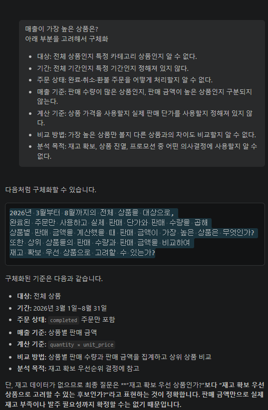
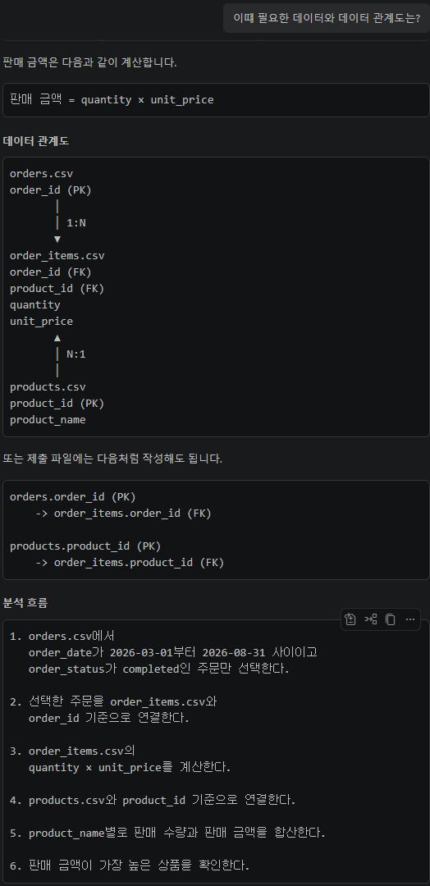
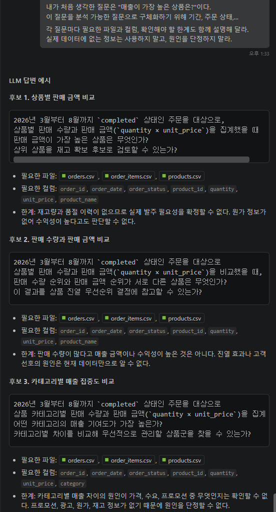
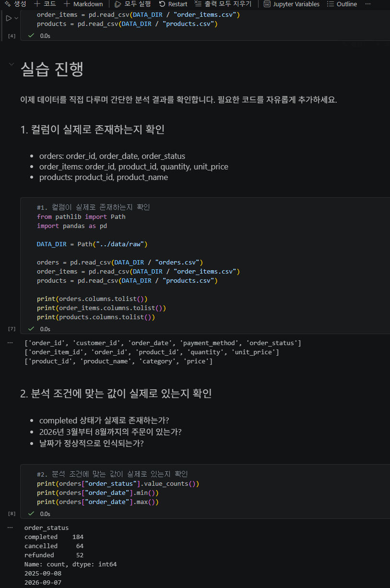
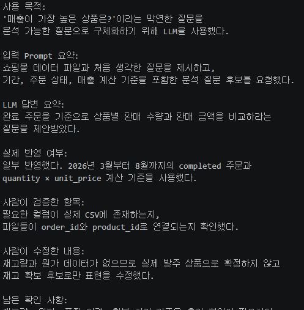
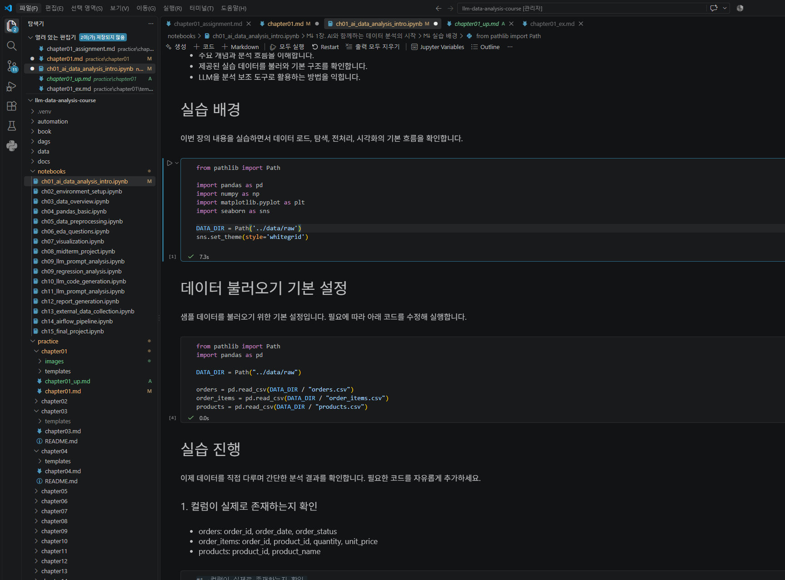

# Chapter 01 제출 답안. AI와 함께하는 데이터 분석의 시작

> 이 파일은 Chapter 01 실습 결과를 정리하여 제출하기 위한 학생용 템플릿입니다.  
> 강사 저장소의 원본 템플릿을 직접 수정하지 말고, 자신의 PC에 복사한 뒤 작성합니다.

---

## 0. 제출 정보

- 이름: 김혜빈
- GitHub ID: Chloe-Hyebin-Kim (https://github.com/Chloe-Hyebin-Kim)
- 개인 저장소명: `llm-data-analysis-study`
- 작성일: 2026-09-08
- 사용한 LLM: 코파일럿

### 최종 제출 URL

```text
https://github.com/Chloe-Hyebin-Kim/llm-data-analysis-course/blob/main/practice/chapter01/chapter01.md
```

---

## 1. 원래 업무 질문

### 내가 선택한 막연한 질문

```text
매출이 가장 높은 상품은? 
```

### 왜 이 질문이 모호하다고 생각했는가?

- 대상: 매출이 프로모션 이벤트 매출인지,전체 상품인지 특정 카테고리 상품인지, 주문수가 많은것인지, 매출 총액이 많은 것인지 알 수 없다. 
- 기준 밎 기간 : 일별, 주별, 월별 중 어떤 단위인지 알 수 없다.
- 매출 기준: 판매 수량이 많은 상품인지, 판매 금액이 높은 상품인지 알 수 없다.
- 계산 기준: 상품 가격을 사용할지, 실제 판매 단가를 사용할지 정해져 있지 않다.
- 분석 목적: 재고 확보, 상품 진열, 프로모션 등 어떤 의사결정에 사용할지 알 수 없다.

### 분석 가능한 질문으로 다시 작성

```text
2026년 3월부터 2026년 8월까지 완료된 주문을 대상으로,
상품별 판매 수량과 판매 금액(수량 × 실제 판매 단가)을 계산했을 때
매출 금액이 가장 높은 상품은 무엇이며, 해당 상품을 재고 확보 우선 상품으로 고려할 수 있는가?
```

### 결과 관찰

처음 질문에는 분석 기간, 주문 상태, 매출 계산 기준이 포함되어 있지 않았다.
이를 완료된 주문, 2026년 3월부터 8월까지의 기간,
상품별 판매 금액이라는 기준으로 구체화했다.
또한 판매 금액만 보지 않고 판매 수량도 함께 확인하도록 질문을 수정했다.

### 나의 해석과 판단

취소나 환불 주문을 필터링 함으로써 허수판별이 가능해졌다.
계산 기준과 매출 기준을 구분함으로써, 이익에 기여도가 높은 것과 구매수랑/빈도가 많은것을 구분할 수 있다. 

### 업무·분석적 의미

매출 금액이 높은 상품을 확인하면 재고 확보나 상품 진열 우선순위를 정하는 데 참고할 수 있다. 
판매 수량과 판매 금액을 함께 비교하면 많이 팔리지만 가격이 낮은 상품과, 판매량은 적지만 금액 기여도가 높은 상품을 구분할 수 있다.

### 한계와 추가 확인 사항

판매량과 매출액을 기준으로 발주 후보 상품을 선정할 수 있지만, 현재 데이터에는 재고량과 품절 이력이 없어 실제 발주 필요성을 판단하는 데 한계가 있다.
현재 데이터에는 프로모션, 광고 유입 재구매여부 등이 없다. 따라서 매출이 높은 상품이라는 사실만으로 수익성이 높다고 단정할 수 없다.
이후 재고와 이익률 데이터를 추가로 확인해야 한다.

### Evidence



---

## 2. 질문과 필요한 데이터 연결

### 필요한 데이터 파일

- [ ] `customers.csv` - 이번 질문에는 고객별 분석이 필요하지 않으므로 제외
- [V] `products.csv`
- [V] `orders.csv`
- [V] `order_items.csv`

### 필요한 컬럼 후보

| 파일 | 필요한 컬럼 | 필요한 이유 |
| --- | --- | --- |
| `orders.csv` | `order_id`, `order_date`, `order_status` | 주문을 상품 상세 데이터와 연결하고, 2026년 3월부터 8월까지의 완료 주문만 필터링하기 위해 필요하다. |
| `order_items.csv` | `order_id`, `product_id`, `quantity`, `unit_price` | 주문별 상품, 판매 수량, 실제 판매 단가를 확인하고 `quantity × unit_price`로 판매 금액을 계산하기 위해 필요하다. |
| `products.csv` | `product_id`, `product_name` | 상품 ID를 상품명으로 바꾸고 상품별 판매 수량과 판매 금액을 집계하기 위해 필요하다. |

### 데이터 연결 관계

```text
orders.order_id (PK) -> order_items.order_id (FK)

products.product_id (PK) -> order_items.product_id (FK)

분석 대상은 order_status가 completed인 주문이며,2026-03-01부터 2026-08-31까지의 주문만 사용한다.
상품별 판매 금액은 order_items.quantity × order_items.unit_price로 계산한다.
```

### 결과 관찰

질문에 답하려면 주문 날짜와 상태를 확인할 수 있는 `orders.csv`,
주문별 상품 수량과 실제 판매 단가를 확인할 수 있는 `order_items.csv`,
상품명을 확인할 수 있는 `products.csv`가 필요하다는 사실을 확인했다.
`customers.csv`는 이번 질문에서 고객별 특성이나 구매 행동을 비교하지 않으므로 사용하지 않는다.
세 파일을 주문 ID와 상품 ID로 연결하면 완료된 주문만 대상으로 상품별 판매 수량과 판매 금액을 계산할 수 있다.


### 나의 해석과 판단

현재 데이터에는  날짜, 상태, 상품별수량,판매 단가, 상품명이 있으므로 상품별 판매 수량과 판매 금액을 계산하는 것까지는 가능하다고 판단했다.
다만 재고량이나 원가 정보 동일 고객 재구매 여부가 없으므로 이 질문의 결과만으로 실제 발주 필요성이나 수익성을 최종 판단할 수는 없다.

### 업무·분석적 의미

질문에 필요한 파일과 컬럼을 먼저 연결하면 어떤 데이터를 사용해 어떤 계산을 해야 하는지
명확해진다. 또한 고객 데이터처럼 현재 질문에 필요하지 않은 데이터를 구분할 수 있어
분석 범위를 줄이고 불필요한 개인정보 사용도 피할 수 있다.

### 한계와 추가 확인 사항

CSV 헤더를 확인한 결과 필요한 컬럼의 존재 여부는 확인했지만, 각 컬럼의 자료형과 결측치,
중복 데이터, 잘못된 날짜 값은 아직 점검하지 않았다. 특히 `order_id`와 `product_id`가
실제로 고유한지, 모든 주문 상세 행이 유효한 주문 및 상품과 연결되는지 추가로 확인해야 한다.
또한 `completed`가 실제 매출 확정 상태인지, 환불 주문이 별도로 표시되는지도 확인할 필요가 있다.

### Evidence

필요한 경우 관계도 또는 데이터 파일 확인 화면을 첨부하세요.



---

## 3. LLM에게 분석 질문 후보 요청

### 사용 목적

```text
내가 정한 막연한 질문을 분석 가능한 질문으로 구체화하고,
현재 데이터로 확인할 수 있는 다른 분석 질문 후보가 있는지 확인하기 위해 LLM을 사용했다.
```

### 사용한 Prompt

```text
나는 온라인 쇼핑몰 데이터를 분석하는 초급 데이터 분석가이다.
현재 사용할 수 있는 파일은 customers.csv, products.csv, orders.csv,
order_items.csv이며, 고객·상품·주문·주문상세 데이터가 있다.

내가 처음 생각한 질문은 "매출이 가장 높은 상품은?"이다.
이 질문을 분석 가능한 질문으로 구체화하기 위해 기간, 주문 상태,
매출 계산 기준, 비교 방법, 분석 목적을 포함한 질문 후보를 3개 제안해 달라.
각 질문마다 필요한 파일과 컬럼, 확인해야 할 한계도 함께 설명해 달라.
실제 데이터에 없는 정보는 사용하지 말고, 원인을 단정하지 말라.
```

### LLM 답변 요약

LLM의 전체 답변을 그대로 복사하지 말고 핵심 제안 3~5개를 요약하세요.

1. 상품별 판매 금액 비교
2. 판매 수량과 판매 금액 비교
3. 카테고리별 매출 집중도 비교

### 결과 관찰

LLM은 기간과 주문 상태를 먼저 정하고, 상품별 수량과 판매 금액을 집계하는 방향의 질문을 주로 제안했다.
또한 단순히 1위 상품만 확인하기보다 판매 수량, 판매 금액, 카테고리별 결과를 함께 비교하도록 제안했다.
현재 데이터에 없는 재고량과 원가를 사용해 수익성이나 발주량을 단정하지 않도록 주의할 필요가 있다.

### 나의 해석과 판단

재고량과 품절 이력이 없으므로 실제 발주 필요성을 확정할 수 없다. 원가 정보가 없어 수익성이 높다고도 판단할 수 없다.
판매 수량이 많다고 매출 금액이나 수익성이 높은 것은 아니다. 진열 효과나 고객 선호의 원인은 현재 데이터만으로 알 수 없다.
카테고리별 매출 차이의 원인이 가격, 수요, 프로모션 중 무엇인지는 확인할 수 없다. 프로모션과 원가, 재고 정보 및 유입경로 등의 정보가 없기 때문에 원인을 단정할 수 없다.

### 업무·분석적 의미

LLM은 막연한 업무 질문에서 분석 대상, 기간, 지표, 비교 기준을 빠뜨리지 않도록 질문 후보를 만드는 데 도움을 줄 수 있다.
다만 LLM이 제안한 질문이 실제 데이터의 컬럼과 업무 목적에 맞는지는 사람이 확인해야 하므로,
LLM은 질문 설계의 보조 역할로 사용하는 것이 적절하다고 판단했다.

### 한계와 추가 확인 사항

LLM이 제안한 기간과 주문 상태가 실제 데이터에 존재하는지 확인해야 한다.
또한 `completed` 주문의 의미, 환불 주문 처리 기준, `quantity`와 `unit_price`의 자료형 및 결측 여부를 점검해야 한다.
재고 확보나 수익성을 판단하려면 재고량, 품절 이력, 원가, 할인 및 프로모션 데이터가 추가로 필요하다.

### Evidence



---

## 4. LLM 제안 검증

LLM 제안 중 하나 이상을 선택해 검토합니다.

| 검증 항목 | 확인 내용 |
| --- | --- |
| 선택한 LLM 제안 | 2026년 3월부터 8월까지 `completed` 주문의 상품별 판매 금액을 비교하고, 매출 상위 상품을 재고 확보 후보로 검토한다. |
| 필요한 파일 | `orders.csv`, `order_items.csv`, `products.csv` |
| 필요한 컬럼 | `order_id`, `order_date`, `order_status`, `product_id`, `product_name`, `quantity`, `unit_price` |
| 계산 범위 | 2026-03-01부터 2026-08-31까지의 `completed` 주문. 상품별 판매 금액은 `quantity × unit_price`로 계산한다. |
| 실제 데이터 확인 필요 여부 | 필요하다. 컬럼 존재 여부뿐 아니라 자료형, 결측치, 중복, 주문 및 상품 ID 연결 상태를 확인해야 한다. |
| 원인 단정 여부 | 매출 상위 상품이라는 결과만 확인하며, 판매 원인·수익성·재고 부족 원인은 단정하지 않는다. |
| 최종 판단 | 수정 후 사용 |

### 내가 수정한 내용

```text
LLM의 제안 중 상품별 판매 금액 비교 부분은 유지했다.
다만 현재 데이터에는 재고량, 품절 이력, 원가, 프로모션 정보가 없으므로
매출 상위 상품을 실제 발주 우선 상품으로 확정하지 않고 재고 확보 후보로만
검토하도록 수정했다. 또한 분석 기간을 2026년 3월부터 8월까지로,
주문 범위를 order_status가 completed인 주문으로 명확히 했다.
```

### 결과 관찰

검증 결과 `orders.csv`에는 주문일과 주문 상태가 있고,
`order_items.csv`에는 상품별 수량과 실제 판매 단가가 있으며,
`products.csv`에는 상품 ID와 상품명이 있어 상품별 판매 금액을 계산할 수 있다.
세 파일은 `order_id`와 `product_id`를 기준으로 연결할 수 있다.
반면 재고량과 원가 정보는 제공되지 않아 발주 필요성이나 수익성은 확인할 수 없다.

### 나의 해석과 판단

이 제안은 현재 데이터의 컬럼으로 상품별 판매 수량과 판매 금액을 계산할 수 있고,
처음 정한 질문과도 직접 연결되므로 `수정 후 사용`으로 판단했다.
그러나 판매 금액이 높다는 사실만으로 재고가 부족하거나 이익이 높다고 볼 수 없으므로,
발주와 수익성에 관한 표현은 후보 검토 수준으로 제한했다.

### 업무·분석적 의미

LLM 제안을 검증하지 않으면 실제로 존재하지 않는 컬럼을 사용하거나,
취소 주문을 포함한 잘못된 판매 금액을 계산할 수 있다.
또한 매출 상위 상품을 곧바로 수익성이 높은 상품이나 발주가 필요한 상품으로
오해하여 잘못된 재고 의사결정을 내릴 수 있다.

### 한계와 추가 확인 사항

Chapter 01 Notebook에서 실제 데이터를 불러와 주문 날짜와 상태를 필터링하고,
order_id와 product_id를 기준으로 세 파일을 연결했다.
상품명이 정상적으로 연결되었고 오류 없이 데이터가 생성되어,
상품별 판매 금액을 계산하는 질문은 현재 데이터로 분석 가능하다고 판단했다.

### Evidence



---

## 5. Prompt Log

- 사용 목적: `매출이 가장 높은 상품은?`이라는 막연한 질문을 분석 가능한 질문으로 구체화하고, 현재 데이터로 검증할 수 있는 질문 후보를 만들기 위해 사용했다.
- 입력 Prompt 요약: 온라인 쇼핑몰의 네 CSV 파일과 처음 생각한 질문을 제시하고, 기간·주문 상태·매출 계산 기준·비교 방법·분석 목적을 포함한 질문 후보 3개와 필요한 파일, 컬럼, 한계를 요청했다.
- LLM 답변 요약: 완료 주문을 기준으로 상품별 판매 수량과 판매 금액을 비교하는 질문, 판매 수량과 판매 금액의 순위를 비교하는 질문, 카테고리별 매출을 비교하는 질문을 제안했다.
- 실제 반영 여부: 일부 반영했다. 상품별 판매 금액 비교 질문을 선택하고, 기간을 2026년 3월부터 8월까지로 정했으며, `completed` 주문과 `quantity × unit_price` 계산 기준을 반영했다.
- 사람이 검증한 항목: 필요한 컬럼의 존재 여부, 주문 상태와 날짜 필터 조건, `order_id`와 `product_id` 연결 관계, 판매 금액 계산 가능 여부를 확인했다.
- 사람이 수정한 내용: 재고량·원가·품절 이력이 없으므로 매출 상위 상품을 실제 발주 상품으로 확정하지 않고 재고 확보 후보로만 검토하도록 수정했다.
- 남은 확인 사항: 전체 데이터의 결측치·중복·이상값, `completed` 상태의 정확한 의미, 환불 처리 기준, 재고량과 원가 데이터의 추가 확보 여부가 남아 있다.

### 결과 관찰

Prompt Log를 통해 막연한 질문을 구체화하고, LLM이 제안한 후보 중 현재 데이터로 검증 가능한 질문을 선택한 과정을 확인할 수 있다.
또한 LLM의 제안을 그대로 사용하지 않고 데이터 컬럼과 업무 목적을 사람이 검토한 뒤 수정한 사실도 확인할 수 있다.

### 나의 해석과 판단

Prompt Log를 남기면 어떤 정보를 바탕으로 LLM에게 질문했는지와 답변 중 어떤 내용을 실제 분석에 반영했는지를 추적할 수 있다.
나중에 분석 결과를 다시 검토하거나 질문을 수정할 때도 의사결정 과정을 확인할 수 있으므로 필요하다고 판단했다.

### Evidence



---

## 6. 개인정보와 Secret 보호 확인

다음 항목을 확인합니다.

- [O] 실제 이름·이메일·전화번호 등 고객 개인정보를 Prompt에 사용하지 않았습니다.
- [O] API Key를 코드나 Notebook에 직접 작성하지 않았습니다.
- [O] `.env` 실제 내용을 캡처하거나 업로드하지 않았습니다.
- [O] GitHub Token, 비밀번호, 내부 URL이 캡처에 보이지 않습니다.
- [O] 제출 전 이미지까지 다시 확인했습니다.

### 나의 판단

고객의 이름, 이메일, 전화번호와 같은 개인정보, API Key, GitHub Token,
비밀번호, `.env` 파일의 실제 내용은 LLM이나 Public GitHub에 올리면 안 된다고 판단했다.
이번 Prompt에는 파일명과 컬럼명, 분석 조건만 사용했고 고객 개인을 식별할 수 있는 원본 행이나
Secret 정보를 포함하지 않았다. 제출 전 Markdown 내용과 Evidence 이미지에 민감한 정보가 없는지 확인했다.

---

## 7. Chapter 01 Notebook 확인

Notebook:

```text
notebooks/ch01_ai_data_analysis_intro.ipynb
```

### 내 환경 상태

- [ ] 아직 환경설정 전이라 Notebook 위치만 확인했습니다.
- [V] 환경설정이 완료되어 Notebook을 직접 실행했습니다. - VSCode 사용하였고, VScode는 처음이라 해당 부분은 GPT통해서 환경설정 차근차근 따라하였습니다. 

### 환경설정 완료 학생만 작성

#### 실행한 코드

```python
from pathlib import Path

import pandas as pd
import numpy as np
import matplotlib.pyplot as plt
import seaborn as sns

DATA_DIR = Path('../data/raw')
sns.set_theme(style='whitegrid')
```

```python
#1. 컬럼이 실제로 존재하는지 확인
from pathlib import Path
import pandas as pd

DATA_DIR = Path("../data/raw")

orders = pd.read_csv(DATA_DIR / "orders.csv")
order_items = pd.read_csv(DATA_DIR / "order_items.csv")
products = pd.read_csv(DATA_DIR / "products.csv")

print(orders.columns.tolist())
print(order_items.columns.tolist())
print(products.columns.tolist())
```

```python
#2. 분석 조건에 맞는 값이 실제로 있는지 확인
print(orders["order_status"].value_counts())
print(orders["order_date"].min())
print(orders["order_date"].max())
```

```python
#3. 세 파일이 정상적으로 연결되는지 확인
orders["order_date"] = pd.to_datetime(orders["order_date"])

completed_orders = orders[
    (orders["order_status"] == "completed")
    & (orders["order_date"] >= "2026-03-01")
    & (orders["order_date"] <= "2026-08-31")
]

merged = completed_orders.merge(
    order_items,
    on="order_id",
    how="inner"
).merge(
    products[["product_id", "product_name"]],
    on="product_id",
    how="left"
)

print(merged.head())
print(merged["product_name"].isna().sum())
```

```python
# 4. 판매 금액을 직접 계산해보기
merged["sales_amount"] = (
    merged["quantity"] * merged["unit_price"]
)

product_sales = (
    merged.groupby(["product_id", "product_name"], as_index=False)
    .agg(
        total_quantity=("quantity", "sum"),
        total_sales=("sales_amount", "sum")
    )
    .sort_values("total_sales", ascending=False)
)

print(product_sales.head(10))
```

```python
# 5. 이상값 확인
print(merged[["quantity", "unit_price"]].describe())

print("결측치")
print(merged[["order_id", "product_id", "quantity", "unit_price"]].isna().sum())

print("0 이하 수량")
print((merged["quantity"] <= 0).sum())

print("0 이하 단가")
print((merged["unit_price"] <= 0).sum())
```


#### 실행 결과

```text
오류 없이 실행되었는지 작성하세요.
```

```text
['order_id', 'customer_id', 'order_date', 'payment_method', 'order_status']
['order_item_id', 'order_id', 'product_id', 'quantity', 'unit_price']
['product_id', 'product_name', 'category', 'price']
```

```text
order_status
completed    184
cancelled     64
refunded      52
Name: count, dtype: int64
2025-09-08
2026-09-07
```

```text
   order_id  customer_id order_date payment_method order_status  \
0         1          123 2026-07-07           card    completed   
1         1          123 2026-07-07           card    completed   
2         1          123 2026-07-07           card    completed   
3         1          123 2026-07-07           card    completed   
4         6           87 2026-05-21      naver_pay    completed   

   order_item_id  product_id  quantity  unit_price product_name  
0              1         100         3      102000    도서 상품 100  
1              2          87         5       25000    도서 상품 087  
2              3           7         3      142000    도서 상품 007  
3              4           9         3      193000   스포츠 상품 009  
4             13          83         3       24000  전자기기 상품 083  
0
```

```text
    product_id product_name  total_quantity  total_sales
9           12    식품 상품 012              17      2975000
6            9   스포츠 상품 009              15      2895000
33          41   스포츠 상품 041              17      2771000
15          18   스포츠 상품 018              23      2507000
62          71  전자기기 상품 071              15      2415000
64          73    도서 상품 073              20      2280000
40          49  전자기기 상품 049              13      2093000
30          38  생활용품 상품 038              12      2076000
18          22  생활용품 상품 022              18      2016000
80          92    식품 상품 092              17      1887000
```

```text
         quantity     unit_price
count  251.000000     251.000000
mean     2.908367  103103.585657
std      1.412646   57084.824841
min      1.000000    5000.000000
25%      2.000000   55000.000000
50%      3.000000  109000.000000
75%      4.000000  161000.000000
max      5.000000  200000.000000
결측치
order_id      0
product_id    0
quantity      0
unit_price    0
dtype: int64
0 이하 수량
0
0 이하 단가
0
```


#### 결과 관찰

Chapter 01 Notebook에서 실제 데이터를 불러와 주문 날짜와 상태를 필터링하고,
order_id와 product_id를 기준으로 세 파일을 연결했다.
상품명이 정상적으로 연결되었고 오류 없이 데이터가 생성되어,
상품별 판매 금액을 계산하는 질문은 현재 데이터로 분석 가능하다고 판단했다.

#### 나의 해석과 판단

현재 Notebook은 pandas와 시각화 라이브러리를 불러오고 데이터 경로를 설정하는 등 분석을 시작하기 위한 기본 환경을 준비하고 
LLM과 상호작용과정을 프롬프트로그로 남기는 과정을 starter scaffold라고 판단했다.
아직 복잡한 전처리나 시각화, 통계 분석을 수행해 최종 인사이트를 제시하는 단계는 아니다.

#### 한계와 추가 확인 사항

본격적인 데이터 구조 파악과 탐색적 분석

#### Evidence



> 환경설정 전이라면 이 이미지는 생략할 수 있습니다.

---

## 8. Chapter 01 최종 해석

### 이번 장에서 가장 중요하다고 생각한 내용

```text
데이터 분석은 코드를 작성하기 전에 분석 질문을 구체적으로 정하는 것에서 시작한다.
분석 목적을 추가하니 분석 방법을 좀더 자세하게 제안해주었다.
분석 목적과 같은 '의사결정'에 관한 내용은 사람이 반드시 가이드를 먼저 제시해야 보다 명확한 답을 얻을 수 있다.
```

### LLM을 데이터 분석에 사용할 때 가장 조심해야 할 점

```text
LLM이 제안한 내용을 사실이나 분석 결과로 바로 받아들이지 않아야 한다.
실제로 있는 데이터인지 확인 하는 과정이 필수적이다. 
또한 개인정보가 유출되지 않도록 해야한다. 
```

### 사람과 LLM의 역할 차이

| 항목 | LLM이 도울 수 있는 부분 | 사람이 책임져야 하는 부분 |
| --- | --- | --- |
| 질문 정의 | 막연한 질문을 구체화하고 분석 질문 후보를 제안한다. | 분석을 위한 목적을 정하고 최종 질문을 선택한다. |
| 데이터 확인 | 필요한 파일과 컬럼, 예상 연결 관계를 정리한다. | 실제 컬럼 존재 여부를 확인하고, 개인정보의 유출 가능성을 확인한다. |
| 코드 작성 | 데이터 불러오기, 필터링, 병합과 집계 코드 초안을 제안한다. | 코드가 현재 데이터 구조와 분석 조건에 맞는지 실행하고 오류와 계산 결과를 검증한다. |
| 결과 해석 | 표와 수치에서 가능한 해석과 추가 질문을 제안한다. | 데이터로 확인된 사실과 추측을 구분하고 원인을 함부로 단정하지 않는다. |
| 최종 판단 | 여러 분석 방향의 장단점을 비교하는 데 도움을 준다. | 분석 결과를 업무에 사용할지 결정하고 한계와 책임을 진다. |

### 다음 Chapter에서 확인하고 싶은 것

```text
이번 장에서 남은 의문이나 Chapter 02~03에서 확인하고 싶은 내용을 작성하세요.
```

---

## 9. 최종 제출 체크리스트

- [ ] 원래 업무 질문과 구체화한 분석 질문을 작성했습니다.
- [ ] 질문에 필요한 데이터 파일과 컬럼 후보를 정리했습니다.
- [ ] LLM Prompt와 답변 요약을 작성했습니다.
- [ ] LLM 제안을 실제 데이터 관점에서 검증했습니다.
- [ ] 각 핵심 STEP의 결과 관찰을 작성했습니다.
- [ ] 각 핵심 STEP의 나의 해석과 판단을 작성했습니다.
- [ ] 업무·분석적 의미를 작성했습니다.
- [ ] 한계와 추가 확인 사항을 작성했습니다.
- [ ] 핵심 실행 Evidence 이미지를 첨부했습니다.
- [ ] 이미지가 Markdown에서 정상 표시됩니다.
- [ ] 개인정보가 없습니다.
- [ ] API Key·Secret·Token이 없습니다.
- [ ] 개인 GitHub 저장소에 업로드했습니다.
- [ ] GitHub에서 Markdown과 이미지가 정상 표시됩니다.
- [ ] 아래 최종 파일 URL이 정상적으로 열립니다.

### 최종 파일 URL

```text
https://github.com/<내-GitHub-ID>/llm-data-analysis-study/blob/main/chapter01/chapter01.md
```

---

## 10. 교수자 확인용 요약

### 수행 상태

- [ ] COMPLETE
- [ ] PARTIAL

### 내가 가장 중요하게 내린 판단 1개

```text
여기에 작성하세요.
```

### 아직 확인이 필요한 내용 1개

```text
여기에 작성하세요.
```
