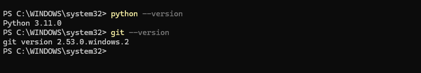
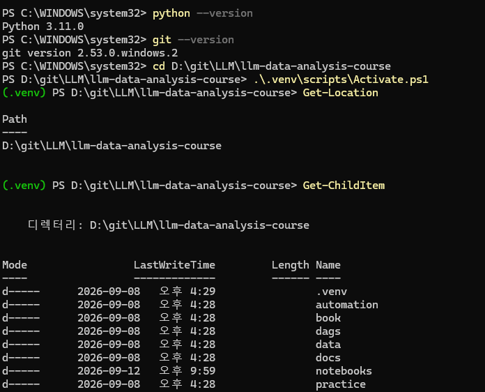
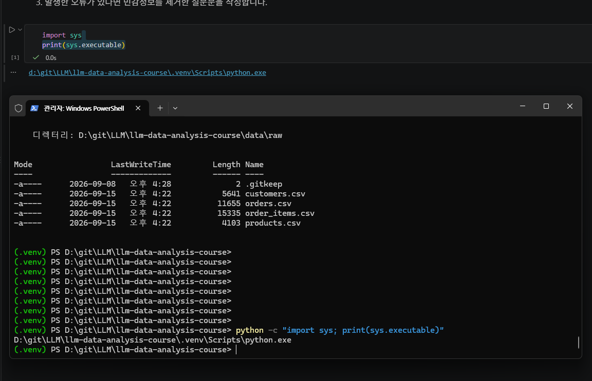
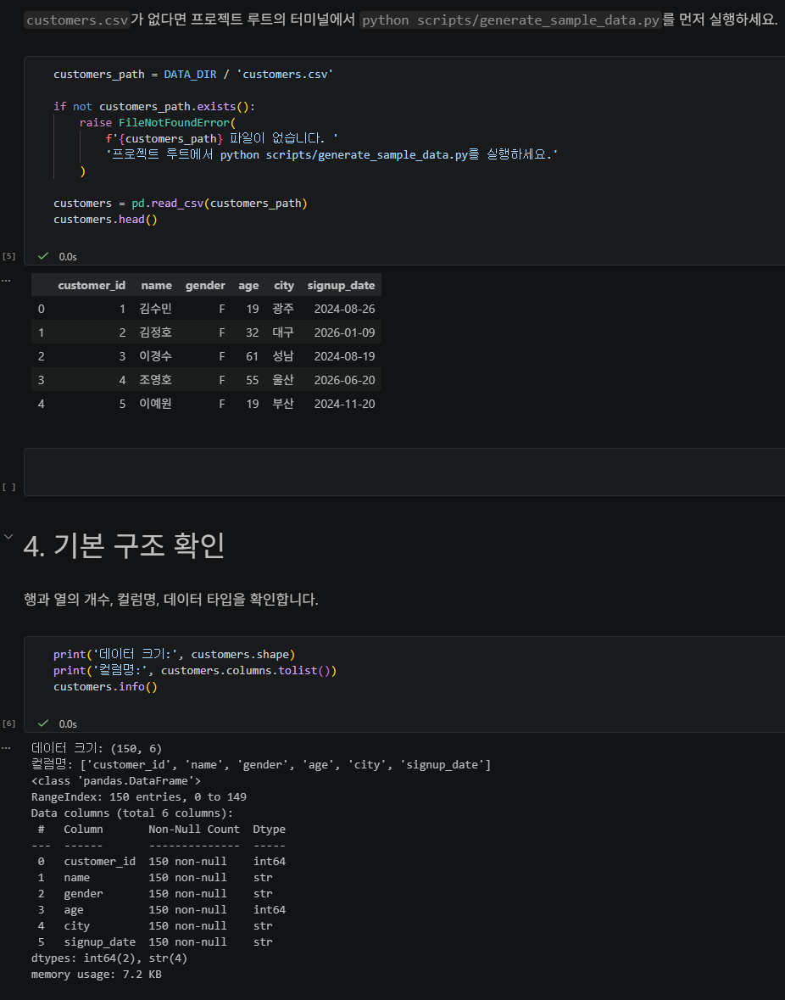
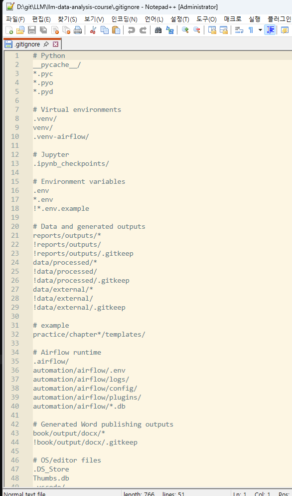

# Chapter 02 제출 답안. VS Code에서 시작하는 데이터 분석 환경

> 최종 파일은 개인 GitHub 저장소의 `chapter02/chapter02.md`로 저장하는 것을 권장합니다.

## 0. 제출 정보

- 이름: 김혜빈
- GitHub ID: Chloe-Hyebin-Kim
- 개인 저장소: `llm-data-analysis-study`
- 작성일: 2026-09-15
- 운영체제: window

### 최종 제출 URL

```text
https://github.com/Chloe-Hyebin-Kim/llm-data-analysis-study/blob/main/chapter02/chapter02.md
```

---

## 1. Python과 Git 환경 확인

### 실행 내용

```text
python --version
git --version
```

### 실행 결과

```text
PS C:\WINDOWS\system32> python --version
Python 3.11.0
PS C:\WINDOWS\system32> git --version
git version 2.53.0.windows.2
```

### Evidence



### 결과 관찰

Python 3.11.0
git version 2.53.0.windows.2

### 나의 해석과 판단

파이썬 3이상으로 적합하다고 판단하였다. 
깃의 경우 개인적으로 VS2008 을 사용해야하는 경우도 있어 해당 버전을 사용하고 있다. 

### 업무·분석적 의미

버전마다 패키지가 달라 호환이 안되거나 함수명이 다른경우가 있다. 
따라서 프로젝트 시작전 환경 설정을 확인해야 한다.

### 한계와 추가 확인 사항

가상환경 활성화 여부

---

## 2. 저장소와 `.venv` 준비

### 수행 내용

- [V] 공식 Public 저장소 clone
- [V] 프로젝트 루트 확인
- [V] `.venv` 생성
- [V] `.venv` 활성화
- [V] `requirements.txt` 설치

### 핵심 실행 결과

```text 
Python 실행 파일: d:\git\LLM\llm-data-analysis-course\.venv\Scripts\python.exe
현재 작업 폴더: d:\git\LLM\llm-data-analysis-course\notebooks

현재 프로젝트 경로:  d:\git\LLM\llm-data-analysis-course
터미널 Python 실행 파일: D:\git\LLM\llm-data-analysis-course\.venv\Scripts\python.exe
가상환경 활성화 여부: 활성화됨 (.venv)
패키지 설치 결과:
```

### Evidence



### 결과 관찰

d:\git\LLM\llm-data-analysis-course\.venv\Scripts\python.exe

### 나의 해석과 판단

하나의 시스템 Python에 모든 패키지를 설치하면 
다른 한 프로젝트의 패키지 버전을 변경했을 때 다른 프로젝트에 영향을 줄 가능성이 매우 높다.

### 업무·분석적 의미

프로젝트에서 사용하는 패키지와 버전을 다른 Python 환경과 분리할 수 있다.
또한 requirements.txt와 같이 필요한 패키지 목록을 관리하면 다른 개발자나 분석가가 동일한 프로젝트를 전달받았을 때 
필요한 의존성을 다시 설치하여 유사한 실행 환경을 구성하기 쉬워진다.

### 한계와 추가 확인 사항

회사나 기관에서 사용하는 PC에서는 보안 정책에 따라 PowerShell 스크립트 실행 등이 제한될 수 있다.

---

## 3. VS Code 인터프리터와 Jupyter 커널 연결

### 확인 결과

```text
VS Code Python 인터프리터:
Notebook sys.executable: d:\git\LLM\llm-data-analysis-course\.venv\Scripts\python.exe
Notebook Path.cwd(): d:\git\LLM\llm-data-analysis-course\notebooks
```

### Evidence



### 결과 관찰

두 경로가 모두 프로젝트의 동일한 .venv 내부를 사용하는 것을 알수 있었음.

### 나의 해석과 판단

터미널에서는 정상적으로 실행되는 코드가 Notebook에서는 실행되지 않거나, 반대로 Notebook에서만 정상적으로 실행되는 문제가 발생할 수 있다.

### 업무·분석적 의미

인터프리터와 Notebook 커널의 실제 실행 환경을 확인하면 ModuleNotFoundError와 같은 환경 관련 오류의 원인을 빠르게 파악할 수 있다.

### 한계와 추가 확인 사항

커널의 표시 이름은 사용자가 임의로 변경이 가능하기 떄문에 항상 반드시 일치한다고 보장할 수 없다.
따라서 sys.executable을 이용하여 Notebook이 실제로 사용하는 Python 실행 파일의 경로를 직접 확인하는 것이 필요하다.

---

## 4. 샘플 데이터와 Notebook 실행 검증

### 확인 결과

```text
Python 실행 파일: d:\git\LLM\llm-data-analysis-course\.venv\Scripts\python.exe
현재 작업 폴더: d:\git\LLM\llm-data-analysis-course\notebooks
프로젝트 루트: d:\git\LLM\llm-data-analysis-course
데이터 폴더: d:\git\LLM\llm-data-analysis-course\data\raw
데이터 폴더 존재 여부: True
customers.csv 존재 여부: True
customers.shape: (150, 6)
주요 컬럼:
['customer_id', 'name', 'gender', 'age', 'city', 'signup_date']
```

### Evidence



### 결과 관찰

데이터의 상위 5개 행이 정상적으로 출력되는 것을 확인했다. customers.shape를 통해 데이터가 [행 개수]개의 행과 [열 개수]개의 열로 구성되어 있음을 확인하였다.

### 나의 해석과 판단

파일의 경로 설정과 파일 접근, pandas를 이용한 파일 로딩, DataFrame 생성까지의 기본 데이터 입력 과정이 정상적으로 수행되었다. 

### 업무·분석적 의미

파일 경로 오류나 누락, 로딩 실패와 같은 구조 등의 문제를 초기에 발견하면 이후 분석 과정에서 발생할 수 있는 오류와 불필요한 작업을 줄일 수 있다.

### 한계와 추가 확인 사항

환경 연결만 확인했으며 데이터 품질은 아직 검증하지 않았습니다.

---

## 5. 오류 해결 기록

실습 중 오류가 있었다면 작성합니다. 오류가 없었다면 `해당 없음`이라고 적습니다.

### 오류 메시지

```text
`해당 없음`
```

### 원인 후보

1.`해당 없음`
2.
3.

### 내가 확인한 순서

1.`해당 없음`
2.
3.

### 해결 방법

```text
`해당 없음`
```

### Evidence


### 나의 해석과 판단

왜 해당 원인이 가장 가능성이 높다고 판단했는지 작성하세요.

### 한계와 추가 확인 사항

보안 정책 변경, 무분별한 삭제처럼 시도하지 않은 조치와 이유를 작성하세요.

---

## 6. Secret 보호 확인

- [V] `.env`는 Git 추적 대상이 아닙니다.
- [V] 실제 API Key를 코드에 작성하지 않았습니다.
- [V] 캡처 화면에 Token/비밀번호가 없습니다.
- [V] `.venv`를 Git에 올리지 않습니다.

### Evidence

필요한 경우 `git status`, `.gitignore` 확인 화면을 첨부합니다.



### 나의 해석과 판단

환경 파일과 비밀정보를 분리해야 하는 이유를 작성하세요.

---

## 7. Chapter 02 최종 회고

### 가장 중요했다고 생각한 환경 설정 1가지


```python
import sys
print(sys.executable)  # 현재 실행하고 있는 Python의 위치

from pathlib import Path
print(Path.cwd())   # 현재 작업 폴더

import pandas as pd

if not customers_path.exists():
    raise FileNotFoundError(
        f'{customers_path} 파일이 없습니다. '
        '프로젝트 루트에서 python scripts/generate_sample_data.py를 실행하세요.'
    )

 #customers_path 생략
customers = pd.read_csv(customers_path) # CSV를 pandas DataFrame으로 읽음
customers.head() #실제 데이터 앞 5행
customers.info() #행 개수, 컬럼명, 결측치 여부(Non-Null Count), 각 컬럼의 자료형(dtype)
```

### 그 이유

```text
C++ 의 경우 VisualStudio 의 .sln에서 프로젝트가 실행 되는 것 처럼 파이썬은 venv 을 통해 환경을 구성하고 설정하는 것 같다.
.venv 를 통해 Python 인터프리터와 패키지 환경을 분리하여 관리할 수 있다는 점을 달리 말하면,설치된 패키지와 버전이 환경마다 다를 수 있다는 말이 된다. 
따라서 내가 의도한 환경에서 Notebook이 실행되고 있는지를 확인해야하는 것 같다.
```

### 다음 Chapter에서 재사용할 환경 체크 3가지

1. 시작 커맨드

```Bash
PS C:\WINDOWS\system32> cd D:\git\LLM\llm-data-analysis-course #이동~
PS D:\git\LLM\llm-data-analysis-course> Get-Location #Path확인
PS D:\git\LLM\llm-data-analysis-course> Get-ChildItem #디렉터리 내부 확인
PS D:\git\LLM\llm-data-analysis-course> code . # vsCODE 열기
PS D:\git\LLM\llm-data-analysis-course> python -m venv .venv #가상환경 만들기
PS D:\git\LLM\llm-data-analysis-course> .\.venv\Scripts\Activate.ps1 #가상환경 열기
(.venv) PS D:\git\LLM\llm-data-analysis-course> python -c "import sys; print(sys.executable)" # 터미널 Python 실행 파일 확인

```


2. Python 인터프리터와 커널 확인 
-  VS Code Python 인터프리터 -> VS Code에서 `Ctrl + Shift + P`를 누른 뒤,    `Python: Select Interpreter`  를 검색
-  `sys.executable`을 통해 Notebook이 실제 사용하는 Python 환경 확인 
-  툴이 일치하는지 확인!!!!!!!!!!!

3. 현재 작업 디렉터리 확인 및 데이터 파일 유무 확인
-  `Path.cwd()`를 이용하여 Notebook의 현재 작업 디렉터리가 프로젝트 루트를 기준으로 올바르게 설정되어 있는지 확인
-  `Path.exists()`로 분석에 필요한 CSV 파일이 실제 경로에 존재하는지 확인

### 현재 환경의 한계 또는 주의점

```text
CMD 하면 명령어가 달라질수 있어 유의해야함.
또한 창을 껐다가 켜면 가상환경을 다시 설정해야함. 
가끔 .\.venv\Scripts\Activate.ps1 이게 안먹히는 경우가 있는데 임시로 차단을 풀수 있음.
```

---

## 최종 제출 체크

- [V] 핵심 Evidence 4~7장을 첨부했습니다.
- [V] 단순 캡처가 아니라 관찰과 판단을 작성했습니다.
- [V] Secret/개인정보가 없습니다.
- [V] GitHub에서 이미지가 정상 표시됩니다.
- [V] 개인 저장소에 `chapter02/chapter02.md`를 업로드했습니다.
- [V] 저장소 URL이 아니라 최종 파일 URL을 제출합니다.